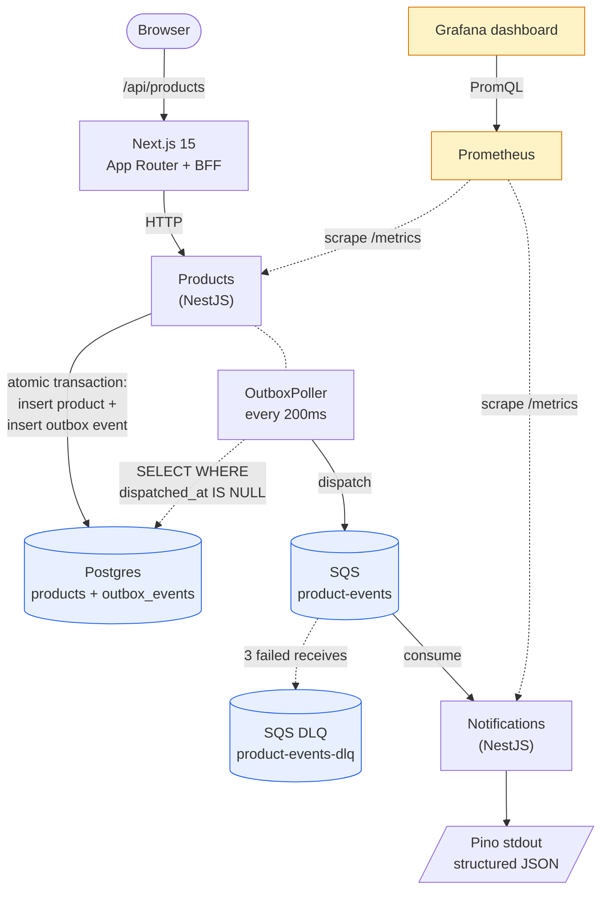

# Universe Test — Products & Notifications

Two NestJS microservices behind a Next.js dashboard, communicating via AWS SQS (Localstack). The whole stack runs with a single `docker compose up`.

## Architecture



## Stack

- **Monorepo**: pnpm workspaces + Turborepo
- **Backend**: NestJS 10, TypeScript strict, class-validator, nestjs-pino, @nestjs/terminus
- **Products**: Prisma 5 + Postgres 16, migrations via `prisma migrate`, OpenAPI/Swagger docs at `/api/docs`
- **Messaging**: AWS SQS via `@ssut/nestjs-sqs`, 1 queue (`product-events`) + DLQ (`product-events-dlq`, redrive after 3 receives)
- **Reliability**: **transactional outbox** — product mutations and their domain events are written in one DB transaction; an `OutboxPoller` drains undispatched rows to SQS every 200ms with retries. Crash-safe between DB commit and SQS send.
- **Shared contracts**: `packages/contracts` — zod schemas + inferred TS types for the event envelope (single source of truth for both services)
- **Observability**: `/metrics` (`@willsoto/nestjs-prometheus`) + `/health` (`@nestjs/terminus`) on both services, scraped by Prometheus, visualised in a provisioned Grafana dashboard (`docker/grafana/dashboards/universe.json`)
- **Frontend**: Next.js 15 (App Router, React 19), Tailwind + Radix primitives, TanStack Query, react-hook-form + zod, Sonner toasts on every mutation. UI calls only the Next BFF route handlers (`/api/products`); Products is never exposed directly to the browser.
- **Container**: multi-stage Dockerfiles for all three apps (node:22-alpine), Next.js `output: 'standalone'`

## Repo layout

```
apps/
  products/        NestJS — POST/DELETE/GET /products, SQS producer
  notifications/   NestJS — SQS consumer, structured logs
  web/             Next.js 15 — UI + BFF
packages/
  contracts/       Shared event envelope (zod + TS)
docker/
  localstack/      init-localstack.sh — creates queues + redrive policy
  prometheus/      prometheus.yml — scrape targets
docker-compose.yml
```

## Quick start

```bash
docker compose up --build
```

That's it — env vars for containerised apps are baked into `docker-compose.yml`, no `.env` setup required.

Open:

| URL                       | What                                              |
|---------------------------|---------------------------------------------------|
| http://localhost:3000     | Products dashboard (UI)                           |
| http://localhost:3001/health, /metrics, /api/docs | Products service (Swagger UI on `/api/docs`) |
| http://localhost:3002/health, /metrics | Notifications service                   |
| http://localhost:9090     | Prometheus (Targets → both services `up`)         |
| http://localhost:3010/d/universe-test | Grafana dashboard (anonymous viewer, auto-provisioned) |
| http://localhost:4566     | Localstack (SQS endpoint)                         |
| localhost:5434            | Postgres (user `postgres` / pwd `root` / db `legaltech_test`) |

### Local development (without containerised apps)

```bash
# 1. Bring up infra only (Postgres on :5434, Localstack on :4566, Prometheus :9090, Grafana :3010)
docker compose up -d psql localstack prometheus grafana

# 2. Copy env templates for each app
cp apps/products/.env.example apps/products/.env
cp apps/notifications/.env.example apps/notifications/.env
cp apps/web/.env.example apps/web/.env.local

# 3. Install + build the shared contracts package + run DB migrations
pnpm install
pnpm --filter @universe-test/contracts build
pnpm --filter @universe-test/products exec prisma migrate dev

# 4. Run the three apps (each in its own terminal)
pnpm --filter @universe-test/products dev          # :3001
pnpm --filter @universe-test/notifications dev     # :3002
pnpm --filter @universe-test/web dev               # :3000
```

The `.env.example` files are checked in; the actual `.env` files are gitignored. For Docker the same vars are injected via `docker-compose.yml`, so this step is only for the local-dev path.

## API

| Method | Endpoint              | Body / Query                                  | Response                                        |
|--------|-----------------------|-----------------------------------------------|-------------------------------------------------|
| POST   | `/products`           | `{ name, description, price }`                | `201` + product (id, name, description, price, timestamps) |
| DELETE | `/products/:id`       | —                                             | `204` (or `404` if missing)                     |
| GET    | `/products`           | `?page=1&limit=20`                            | `200` + `{ items, total, page, limit, totalPages }` |

The frontend calls `/api/products[/:id]` on its own host; the route handlers proxy to Products via `PRODUCTS_API_URL`.

## Event envelope

Every SQS message follows this shape (defined once in `packages/contracts`, validated with zod on the consumer):

```jsonc
{
  "eventId":    "uuid v4",
  "eventType":  "product.created" | "product.deleted",
  "occurredAt": "ISO-8601 datetime",
  "payload":    { /* full product for created, { id } for deleted */ }
}
```

## Tests

16 tests total:

```bash
pnpm --filter @universe-test/products test         # 10 unit (service + publisher + outbox poller)
pnpm --filter @universe-test/products test:e2e     # 3 supertest e2e
pnpm --filter @universe-test/notifications test    # 3 unit
```

Coverage spans:
- **ProductsService** — create/delete/list, atomic product+outbox writes, `P2025 → NotFoundException` mapping, no outbox write on missing-id
- **Publisher** — envelope shape validated with the **same zod schema the consumer uses**, both event types
- **OutboxPoller** — happy path (dispatch + mark sent), failure path (increment attempts, leave pending for retry), corrupt-row sealing (no infinite retry loop), pending gauge updates
- **Consumer** — valid event, invalid envelope, empty body
- **HTTP layer (e2e)** — 201 on valid POST + outbox row written, 400 on invalid body, 200 with pagination shape
